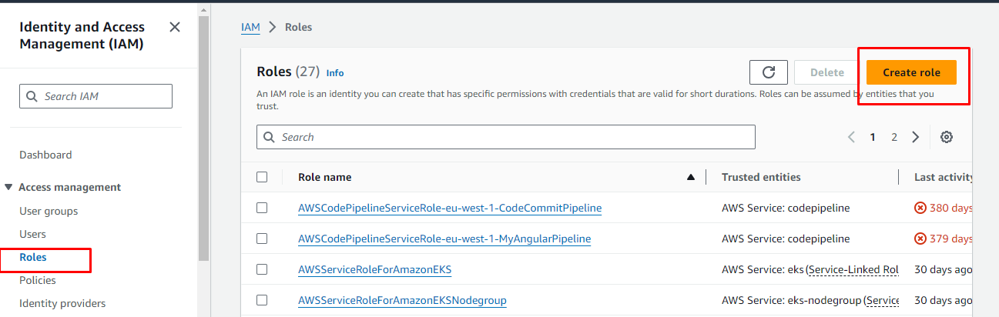
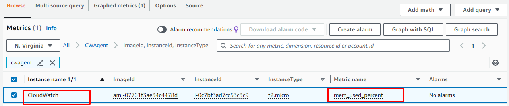

## Monitoring AWS EC2 using CloudWatch

In this project I manage AWS infrastucture using CloudWatch and CloudTrail, gaining insights into system perfomance, security and operational health.


### Step 1: Create an IAM Roe with CloudWatchFull Access and SSMFullAccess

  1. Navigate to the IAM console
  2. In the IAM Console navigation click on roles.




  3. Now create the images to create a role with `CloudWatchFullAccess` and `SSMFullAccess` policy


 


###  Step 2: Create a parameter in System Manager  

Now that wehave created an IAM role, we need to create a parameter in the system manager console. By doing this, we will be abl to define the metrics we want to monitor for our EC2 instance.

  1. Navigate to AWS System Manager Console
  2. In the AWS System Manager navigate menu, select parameter store

  

  3. Create a new parameter and paste the code snippet below.

  ```
  {
	"metrics": {
		"append_dimensions": {
			"InstanceId": "${aws:InstanceId}"
		},
		"metrics_collected": {
			"mem": {
				"measurement": [
					"mem_used_percent"
				],
				"metrics_collection_interval": 180
			},
            "disk": {
				"measurement": [
                     "disk_used_percent"
				],
				"metrics_collection_interval": 180
			}
		}
	}
} 
 
  ```


The parameter above are configuration file for the CloudWatch agent, which defines the metrics that will be collected from your EC2 instance and sent to CloudWatch.

 1. `"metrics"` : This is the top-leve key in the configuration file, indicating that it contains the definitions for the metrics to be collected.

 2. `"append_dimensions"` : This section specifies dimensions to be appended to all collected etrics. Dimensions are key-value pairs that help identify the source of the data in CloudWatch. In this case, the dimension "InstanceId" is appended, and its value populated dynamically with the instance ID of the EC2 instance where the CloudWatch agent is installed.

     - `"InstanceId" : "${aws:InstanceId}"` : This line specifies that the value of the "InstanceId" dimension should be dynamically populated with the instance ID of the EC2 instance.

3. `"metrics_collected"` :This section defines the specific metrics to be collected from the EC2 instance.

     - `"mem"` : This subsection specifies memory-related metrics to be collected.

        - `"measurement"` : This is an array specific memory metrics to collect. In this case only `mem_used_percent` is psecified, whic represents the percentage of memory used on the instance.
        - `"metrics_collection_interval"` : This parmeter specifies how frequently(in seconds) the metrics should be collected. Here, memory metrics will be collected every 60 seconds.

    - `"disk"` : This subsection specifies disk-related metrics to be collected

       - `"measurement"` : This is an array of specific disk metrics to collect. Only `"disk_used_percent"` is specified, representing the percentage of disk space used on the instance.
       - `"metrics_collection_interval"` : Similar to the memory sections, this parameter specifies how frequently disk metrics will be collected, which is every 60 seconds.


### Step 3:  Create an EC2 instance, attach the role created in Step 1

Now that we have created an IAM Role and also created a paramaeter in the Account System Manager Console, let's create an EC2 instance and that roles we created eralier. But note that `SSM` will have access to the paparameter we created and by attaching the role to the EC2 instance, EC2 will also have access to the parameters.


  1. Navigate to the EC2 console, select instance. Click on the launch instance on top right.

  2. Now we will need to launch an `Amazon linux 2 instance` and attach the role we created in `step 1`. Follow the images below to attach IAM role to your instance.


  3. Install CloudWatch agent. Create a file name it `script.sh` and paste the shell script below.

  

  ```
  #!/bin/bash
wget https://s3.amazonaws.com/amazoncloudwatch-agent/linux/amd64/latest/AmazonCloudWatchAgent.zip
unzip AmazonCloudWatchAgent.zip
sudo ./install.sh
sudo /opt/aws/amazon-cloudwatch-agent/bin/amazon-cloudwatch-agent-ctl -a fetch-config -m ec2 -c ssm:/alarm/AWS-CWAgentLinConfig -s

  
  ```

- Make the file executable run `sudo chmod +x script.sh`
- Save and run the file run `./script.sh`


4. Start the CloudWatch agent ` sudo /opt/aws/amazon-cloudwatch-agent/bin/amazon-cloudwatch-agent-ctl -m ec2 -a start
`


5. Verify if CloudWatch is installed and successfully running ` sudo /opt/aws/amazon-cloudwatch-agent/bin/amazon-cloudwatch-agent-ctl -m ec2 -a status
`


### Step 4: Monitor your metric in CloudWatch

Before we can monitor our EC2 instance metrics, create a new policy and attach it to our IAM role so that the role does not lack permissions to perform the ec2: DescribeTags action, which is necessary for the CloudWatch agent to retrieve EC2 instance tags.

  1. Create a new Policy

  - In the IAM console navigation menu, click on the policy and on the top right, select create policy. Follow the images below to ceate a new policy for the IAM role. Use the Json code snippet below for your policy.

  ```
  {
    "Version": "2012-10-17",
    "Statement": [
        {
            "Effect": "Allow",
            "Action": [
                "ec2:DescribeTags"
            ],
            "Resource": "*"
        }
    ]
}

  ```

  
  
  
  
  
 

  2. Let's recall the parameters we crated for our EC2 metric, now let's view the metric on ClodWatch console.

  - Navigate to the CloudWatch console. In the navigation menu, select all metrics.

   

  - Select the browser tab and search and click on CWAgent

   

  - Select either of the two as highlighted in the image below to view any of the metrics we defined in our parameter.

 

  - We can view our metric the memory percent of our EC2 instance.

  We have successfully installed and configured CloudWatch to monitor your EC2 instance.


# THE END !!!


